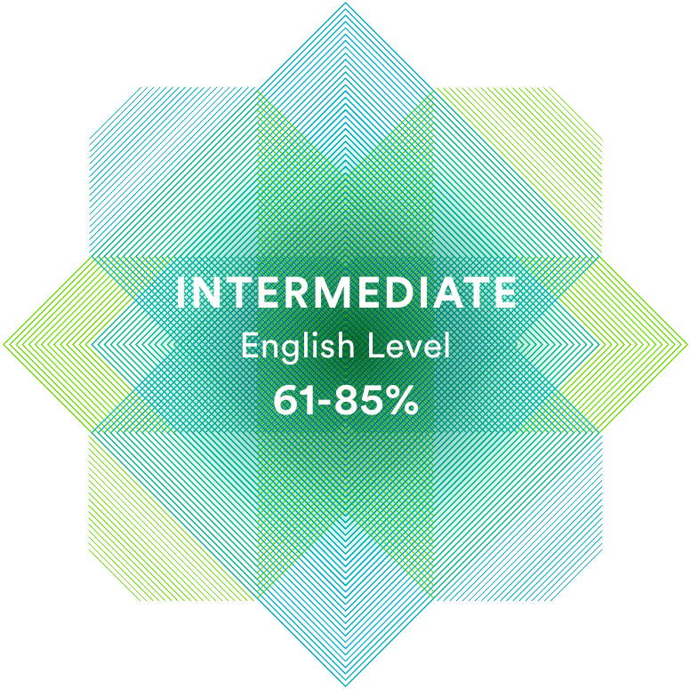

# Olesya Valyn
### Junior Frontend Developer


---

### Contact information:
Phone: +79507935173  
E-mail: olesya.valyn.12@gmail.com  
Discord: Olesya Valyn (@lesya-val)  
Telegram: [OlesyaVal](https://t.me/OlesyaVal)  
GitHub: [lesya-val](https://github.com/lesya-val)  

---

### Briefly About Myself:
I'm a second-year student of a technical university in the speciality "Software engineering".  
A year ago, I first encountered Frontend-development in a training practice. After passing it, I realized that this is exactly the direction in which I want to develop.  
Since then, I've been spending my free time studying web-development, and I'm not going to stop.  
I hope that my desire to acquire new skills and the ability to approach work responsibly will help me become an experienced Frontend-developer and get a job. 

---

### Skills:
- HTML  
- CSS (Framework Bootstrap, Preprocessor SCSS, BEM methodology)  
- JavaScript (Basic), C++ (Basic), Python (Basic) 
- Git, GitHub  
- ОС Windows, Linux(Ubuntu)  
- Figma (for web-development)  
- VSCode, WebStorm, Pycharm

---

### Code example:
Task from Codewars (7kye): [Vowel Count](https://www.codewars.com/kata/54ff3102c1bad923760001f3)
```
function getCount(str) {
  let reg = str.match(/[a\e\i\o\u]/g)
  return reg === null ? 0: reg.length
}
```

---

### Education:
- JavaScript Manual on [learn.javascript.ru](https://learn.javascript.ru/) (in progress)  
- RS Schools Course [«JavaScript/Front-end. Stage 1»](https://rs.school/js/) (in progress)
- Stepic Course ["Поколение Python": курс для начинающих](https://stepik.org/course/58852/promo#toc) (completed)  


---

### Languages:
- Russian - Native
- English - Intermediate (according to the online test at [EF SET](https://www.efset.org/quick-check/))  
